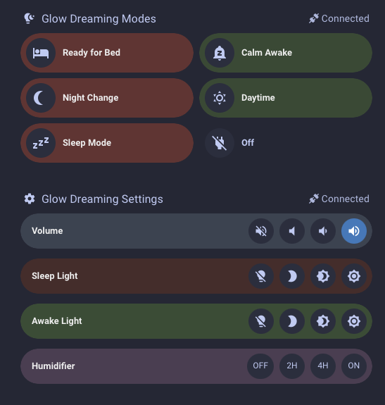

# Glowdreaming Panels



This is my configuration for the various Glow Dreaming panels that I've got in my current dashboard.

The templates used are from [templates](./templates.md).

```yaml
type: grid
cards:
  - type: heading
    heading: Glow Dreaming Modes
    heading_style: title
    icon: mdi:lightbulb-night
    badges:
      - type: entity
        show_state: true
        show_icon: true
        entity: sensor.glowdreaming_sensor
        state_content: connected
        icon: mdi:connection
  - type: custom:bubble-card
    card_type: button
    button_type: name
    button_action:
      tap_action:
        action: perform-action
        perform_action: script.glow_dreaming_ready_for_bed
        target: {}
        confirmation:
          text: Are you sure?
    name: Ready for Bed
    icon: mdi:bed
    grid_options:
      columns: 6
      rows: 1
    styles: |
      @media (prefers-color-scheme: light) {
        .bubble-button-background {
          background: #ffe0e0 !important;
        }
        .bubble-name {
          color: #1a1a1a !important;
        }
      }
      @media (prefers-color-scheme: dark) {
        .bubble-button-background {
          background: #713939 !important;
        }
        .bubble-name {
          color: #f0f0f0 !important;
        }
      }
      .bubble-icon-container {
        background: ${hass.states['sensor.glow_dreaming_scene_template'].state === 'ready_for_bed' ? 'rgb(64, 132, 195)' : ''} !important;
        color: ${hass.states['sensor.glow_dreaming_scene_template'].state === 'ready_for_bed' ? 'white' : ''} !important;
      }
  - type: custom:bubble-card
    card_type: button
    button_type: name
    button_action:
      tap_action:
        action: perform-action
        perform_action: script.glow_dreaming_calm_awake
        target: {}
        confirmation:
          text: Are you sure?
    name: Calm Awake
    icon: mdi:bell-sleep
    grid_options:
      columns: 6
      rows: 1
    styles: |
      @media (prefers-color-scheme: light) {
        .bubble-button-background {
          background-color: #d8f7d5;
        }
        .bubble-name {
          color: #1a1a1a !important;
        }
      }
      @media (prefers-color-scheme: dark) {
        .bubble-button-background {
          background-color: #3e543b;
        }
        .bubble-name {
          color: #f0f0f0 !important;
        }
      }
  - type: custom:bubble-card
    card_type: button
    button_type: name
    button_action:
      tap_action:
        action: perform-action
        perform_action: script.set_glow_dreaming_to_night_change_red_noise
        target: {}
        confirmation:
          text: Are you sure?
    name: Night Change
    icon: mdi:moon-waning-crescent
    grid_options:
      columns: 6
      rows: 1
    styles: |
      @media (prefers-color-scheme: light) {
        .bubble-button-background {
          background: #ffe0e0 !important;
        }
        .bubble-name {
          color: #1a1a1a !important;
        }
      }
      @media (prefers-color-scheme: dark) {
        .bubble-button-background {
          background: #713939 !important;
        }
        .bubble-name {
          color: #f0f0f0 !important;
        }
      }
      .bubble-icon-container {
        background: ${hass.states['sensor.glow_dreaming_scene_template'].state === 'ready_for_bed' ? 'rgb(64, 132, 195)' : ''} !important;
        color: ${hass.states['sensor.glow_dreaming_scene_template'].state === 'ready_for_bed' ? 'white' : ''} !important;
      }
  - type: custom:bubble-card
    card_type: button
    button_type: name
    button_action:
      tap_action:
        action: perform-action
        perform_action: script.glow_dreaming_daytime
        target: {}
        confirmation:
          text: Are you sure?
    name: Daytime
    icon: mdi:weather-sunny
    grid_options:
      columns: 6
      rows: 1
    styles: |
      @media (prefers-color-scheme: light) {
        .bubble-button-background {
          background-color: #d8f7d5;
        }
        .bubble-name {
          color: #1a1a1a !important;
        }
      }
      @media (prefers-color-scheme: dark) {
        .bubble-button-background {
          background-color: #3e543b;
        }
        .bubble-name {
          color: #f0f0f0 !important;
        }
      }
  - type: custom:bubble-card
    card_type: button
    button_type: name
    button_action:
      tap_action:
        action: perform-action
        perform_action: script.set_glow_dreaming_for_sleep
        target: {}
        confirmation:
          text: Are you sure?
    name: Sleep Mode
    icon: mdi:sleep
    grid_options:
      columns: 6
      rows: 1
    styles: |
      @media (prefers-color-scheme: light) {
        .bubble-button-background {
          background: #ffe0e0 !important;
        }
        .bubble-name {
          color: #1a1a1a !important;
        }
      }
      @media (prefers-color-scheme: dark) {
        .bubble-button-background {
          background: #713939 !important;
        }
        .bubble-name {
          color: #f0f0f0 !important;
        }
      }
      .bubble-icon-container {
        background: ${hass.states['sensor.glow_dreaming_scene_template'].state === 'ready_for_bed' ? 'rgb(64, 132, 195)' : ''} !important;
        color: ${hass.states['sensor.glow_dreaming_scene_template'].state === 'ready_for_bed' ? 'white' : ''} !important;
      }
  - type: custom:bubble-card
    card_type: button
    button_type: name
    button_action:
      tap_action:
        action: perform-action
        perform_action: script.turn_off_glow_dreaming
        target: {}
        confirmation:
          text: Are you sure?
    name: "Off"
    icon: mdi:power-plug-off
    grid_options:
      columns: 6
      rows: 1
  - type: heading
    icon: mdi:cog
    heading: Glow Dreaming Settings
    heading_style: title
    badges:
      - type: entity
        show_state: true
        show_icon: true
        entity: sensor.glowdreaming_sensor
        state_content: connected
        icon: mdi:connection
  - type: custom:bubble-card
    card_type: button
    button_type: name
    name: Volume
    icon: ""
    grid_options:
      columns: full
      rows: 1
    show_icon: false
    card_layout: normal
    styles: |
      @media (prefers-color-scheme: light) {
        .bubble-button-background {
          background-color: #e4edfc !important;
        }
        .bubble-name {
          color: #1a1a1a !important;
        }
      }
      @media (prefers-color-scheme: dark) {
        .bubble-button-background {
          background: #434c5b !important;
        }
        .bubble-name {
          color: #f0f0f0 !important;
        }
      }
      .bubble-sub-button-2 {
        background: ${hass.states['sensor.glowdreaming_volume'].state === 'Low' ? 'rgb(64, 132, 195)' : ''} !important;
        color: ${hass.states['sensor.glowdreaming_volume'].state === 'Low' ? 'white' : ''} !important;
      }
      .bubble-sub-button-3 {
        background: ${hass.states['sensor.glowdreaming_volume'].state === 'Medium' ? 'rgb(64, 132, 195)' : ''} !important;
        color: ${hass.states['sensor.glowdreaming_volume'].state === 'Medium' ? 'white' : ''} !important;
      }
      .bubble-sub-button-4 {
        background: ${hass.states['sensor.glowdreaming_volume'].state === 'High' ? 'rgb(64, 132, 195)' : ''} !important;
        color: ${hass.states['sensor.glowdreaming_volume'].state === 'High' ? 'white' : ''} !important;
      }
    sub_button:
      - name: "Off"
        icon: mdi:volume-off
        tap_action:
          action: perform-action
          perform_action: glowdreaming.set_volume
          target:
            device_id: 3c0430c188e092e580e712f686a09db5
          data:
            volume: None
          confirmation:
            text: Are you sure?
      - icon: mdi:volume-low
        tap_action:
          action: perform-action
          perform_action: glowdreaming.set_volume
          target:
            device_id: 3c0430c188e092e580e712f686a09db5
          data:
            volume: Low
          confirmation:
            text: Are you sure?
      - icon: mdi:volume-medium
        tap_action:
          action: perform-action
          perform_action: glowdreaming.set_volume
          target:
            device_id: 3c0430c188e092e580e712f686a09db5
          data:
            volume: Medium
          confirmation:
            text: Are you sure?
      - icon: mdi:volume-high
        tap_action:
          action: perform-action
          perform_action: glowdreaming.set_volume
          target:
            device_id: 3c0430c188e092e580e712f686a09db5
          data:
            volume: High
          confirmation:
            text: Are you sure?
  - type: custom:bubble-card
    card_type: button
    button_type: name
    name: Sleep Light
    styles: |
      @media (prefers-color-scheme: light) {
        .bubble-button-background {
          background-color: #ffe0e0 !important;
        }
        .bubble-name {
          color: #1a1a1a !important;
        }
      }
      @media (prefers-color-scheme: dark) {
        .bubble-button-background {
          background: #523131 !important;
        }
        .bubble-name {
          color: #f0f0f0 !important;
        }
      }

      .bubble-sub-button-2 {
        background: ${hass.states['sensor.glow_dreaming_light_template'].state === 'Sleep_Low' ? 'rgb(170, 0, 0)' : ''} !important;
        color: ${hass.states['sensor.glow_dreaming_light_template'].state === 'Sleep_Low' ? 'white' : ''} !important;
      }
      .bubble-sub-button-3 {
        background: ${hass.states['sensor.glow_dreaming_light_template'].state === 'Sleep_Medium' ? 'rgb(170, 0, 0)' : ''} !important;
        color: ${hass.states['sensor.glow_dreaming_light_template'].state === 'Sleep_Medium' ? 'white' : ''} !important;
      }
      .bubble-sub-button-4 {
        background: ${hass.states['sensor.glow_dreaming_light_template'].state === 'Sleep_High' ? 'rgb(170, 0, 0)' : ''} !important;
        color: ${hass.states['sensor.glow_dreaming_light_template'].state === 'Sleep_High' ? 'white' : ''} !important;
      }
    grid_options:
      columns: full
      rows: 1
    show_icon: false
    card_layout: normal
    sub_button:
      - name: "Off"
        icon: mdi:lightbulb-off
        tap_action:
          action: perform-action
          perform_action: glowdreaming.set_sleep_brightness
          target:
            device_id: 3c0430c188e092e580e712f686a09db5
          data:
            brightness: None
          confirmation:
            text: Are you sure?
      - icon: mdi:brightness-2
        tap_action:
          action: perform-action
          perform_action: glowdreaming.set_sleep_brightness
          target:
            device_id: 3c0430c188e092e580e712f686a09db5
          data:
            brightness: Low
          confirmation:
            text: Are you sure?
      - icon: mdi:brightness-4
        tap_action:
          action: perform-action
          perform_action: glowdreaming.set_sleep_brightness
          target:
            device_id: 3c0430c188e092e580e712f686a09db5
          data:
            brightness: Medium
          confirmation:
            text: Are you sure?
      - icon: mdi:brightness-7
        tap_action:
          action: perform-action
          perform_action: glowdreaming.set_sleep_brightness
          target:
            device_id: 3c0430c188e092e580e712f686a09db5
          data:
            brightness: High
          confirmation:
            text: Are you sure?
  - type: custom:bubble-card
    card_type: button
    button_type: name
    name: Awake Light
    grid_options:
      columns: full
      rows: 1
    styles: |
      @media (prefers-color-scheme: light) {
        .bubble-button-background {
          background-color: #d8f7d5 !important;
        }
        .bubble-name {
          color: #1a1a1a !important;
        }
      }
      @media (prefers-color-scheme: dark) {
        .bubble-button-background {
          background: #3f573c !important;
        }
        .bubble-name {
          color: #f0f0f0 !important;
        }
      }

      .bubble-sub-button-2 {
        background: ${hass.states['sensor.glow_dreaming_light_template'].state === 'Awake_Low' ? 'rgb(0, 101, 21)' : ''} !important;
        color: ${hass.states['sensor.glow_dreaming_light_template'].state === 'Awake_Low' ? 'white' : ''} !important;
      }
      .bubble-sub-button-3 {
        background: ${hass.states['sensor.glow_dreaming_light_template'].state === 'Awake_Medium' ? 'rgb(0, 101, 21)' : ''} !important;
        color: ${hass.states['sensor.glow_dreaming_light_template'].state === 'Awake_Medium' ? 'white' : ''} !important;
      }
      .bubble-sub-button-4 {
        background: ${hass.states['sensor.glow_dreaming_light_template'].state === 'Awake_High' ? 'rgb(0, 101, 21)' : ''} !important;
        color: ${hass.states['sensor.glow_dreaming_light_template'].state === 'Awake_High' ? 'white' : ''} !important;
      }
    show_icon: false
    card_layout: normal
    sub_button:
      - name: "Off"
        icon: mdi:lightbulb-off
        tap_action:
          action: perform-action
          perform_action: glowdreaming.set_awake_brightness
          target:
            device_id: 3c0430c188e092e580e712f686a09db5
          data:
            brightness: None
          confirmation:
            text: Are you sure?
      - icon: mdi:brightness-2
        tap_action:
          action: perform-action
          perform_action: glowdreaming.set_awake_brightness
          target:
            device_id: 3c0430c188e092e580e712f686a09db5
          data:
            brightness: Low
          confirmation:
            text: Are you sure?
      - icon: mdi:brightness-4
        tap_action:
          action: perform-action
          perform_action: glowdreaming.set_awake_brightness
          target:
            device_id: 3c0430c188e092e580e712f686a09db5
          data:
            brightness: Medium
          confirmation:
            text: Are you sure?
      - icon: mdi:brightness-7
        tap_action:
          action: perform-action
          perform_action: glowdreaming.set_awake_brightness
          target:
            device_id: 3c0430c188e092e580e712f686a09db5
          data:
            brightness: High
          confirmation:
            text: Are you sure?
  - type: custom:bubble-card
    card_type: button
    button_type: name
    name: Humidifier
    icon: ""
    grid_options:
      columns: full
      rows: 1
    show_icon: false
    card_layout: normal
    sub_button:
      - name: "OFF"
        icon: ""
        tap_action:
          action: perform-action
          perform_action: glowdreaming.set_humidifier
          target:
            device_id: 3c0430c188e092e580e712f686a09db5
          data:
            humidifier: None
          confirmation:
            text: Are you sure?
        show_name: true
        show_icon: false
      - icon: mdi:volume-low
        tap_action:
          action: perform-action
          perform_action: glowdreaming.set_humidifier
          target:
            device_id: 3c0430c188e092e580e712f686a09db5
          data:
            humidifier: 2 Hours
          confirmation:
            text: Are you sure?
        show_icon: false
        show_name: true
        name: 2H
      - icon: ""
        tap_action:
          action: perform-action
          perform_action: glowdreaming.set_humidifier
          target:
            device_id: 3c0430c188e092e580e712f686a09db5
          data:
            humidifier: 4 Hours
          confirmation:
            text: Are you sure?
        show_icon: false
        show_state: true
        name: 4H
        show_name: true
      - icon: ""
        tap_action:
          action: perform-action
          perform_action: glowdreaming.set_humidifier
          target:
            device_id: 3c0430c188e092e580e712f686a09db5
          data:
            humidifier: Continuous
          confirmation:
            text: Are you sure?
        show_state: false
        show_name: true
        show_icon: false
        name: "ON"
    styles: |-
      @media (prefers-color-scheme: light) {
        .bubble-button-background {
          background-color: #f8e4ff !important;
        }
        .bubble-name {
          color: #1a1a1a !important;
        }
      }
      @media (prefers-color-scheme: dark) {
        .bubble-button-background {
          background-color: #56455c !important;
        }
        .bubble-name {
          color: #f0f0f0 !important;
        }
      }
```
